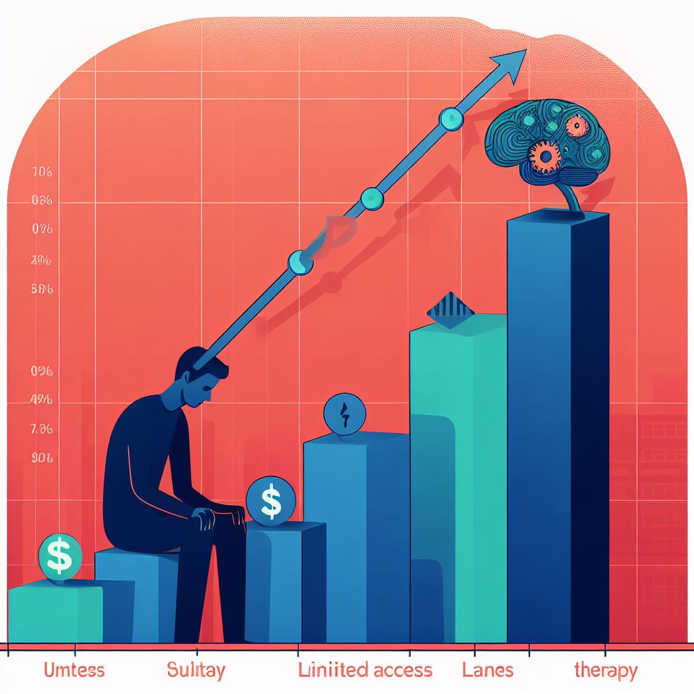

# MindScape AI VR
"Revolutionizing Mental Health Care"

## Problem
Millions of people worldwide are facing significant mental health challenges, and traditional therapeutic options often fall short in addressing their needs. Barriers such as stigma, limited accessibility, and cost prevent many individuals from seeking the mental health support they require. As a result, there is a pressing need for an innovative and accessible solution that caters to the diverse mental health concerns of users.

  

### Users:

* Individuals with Anxiety Disorders: Users who experience anxiety disorders, including generalized anxiety, social anxiety, and panic disorders, often require personalized therapeutic interventions to alleviate their symptoms.

* Patients with Phobias: Those suffering from specific phobias, such as fear of heights, flying, or public speaking, can benefit from exposure therapy provided in a controlled virtual environment.

* Depression Sufferers: Individuals dealing with depression, including major depressive disorder, may find value in MindScape's ability to offer a structured and engaging approach to therapy.

* PTSD Survivors: People who have experienced traumatic events and have post-traumatic stress disorder (PTSD) can use MindScape to address trauma-related symptoms.

* Individuals Seeking Stress Reduction: Users looking to manage and reduce stress, whether caused by work, personal life, or other factors, can benefit from relaxation and mindfulness exercises offered by MindScape.

### Use Cases:

* Personalized Therapy: MindScape provides individuals with a personalized therapy experience tailored to their specific mental health needs. For example, a user with social anxiety may engage in role-playing scenarios in a virtual environment to practice social interactions.

* Exposure Therapy: Users with specific phobias can gradually confront their fears within a controlled virtual environment. For instance, someone with a fear of flying can use MindScape to simulate the experience of being on an airplane.

* Cognitive Behavioral Therapy (CBT): The platform offers interactive exercises to help users identify and challenge negative thought patterns. This is beneficial for those with depression or anxiety disorders.

* Stress Reduction and Mindfulness: Users looking to manage stress and enhance mindfulness can participate in relaxation exercises, deep-breathing activities, and guided meditation sessions within the VR environment.

* Progress Tracking: MindScape allows individuals to monitor their mental health progress by providing insights based on physiological responses during therapy sessions. This feature is crucial for all users to understand their journey and areas of improvement.

MindScape aims to address the problem of limited accessibility and effectiveness in traditional mental health therapy by providing a wide range of use cases, making it an inclusive solution for individuals with various mental health concerns. Its innovative approach personalizes therapy and reduces the stigma associated with seeking help, ultimately improving the well-being of its diverse user base.

## Solution

MindScape is a cutting-edge mental health solution that harnesses the power of a VR headset and AI to deliver personalized therapy in immersive virtual environments. It adapts in real-time based on user responses, offering an engaging and effective path to well-being.

### Main Features:

* Personalized Therapy: MindScape utilizes artificial intelligence (AI) to provide highly personalized therapy sessions. It tailors the virtual reality (VR) experience to the individual's specific mental health needs, ensuring that each therapy session is relevant and effective.

* Real-Time Adaptation: One of MindScape's standout features is its ability to adapt therapy sessions in real-time. The AI monitors the user's physiological responses, such as heart rate and skin conductance, to assess their emotional state during the session. If stress or anxiety levels rise, the AI can modify the session to ensure a manageable and supportive experience.

* Immersive Environments: Users have access to a variety of immersive virtual environments, each designed to address different aspects of mental health. This includes serene and calming settings for relaxation, challenging environments for exposure therapy, and interactive spaces for cognitive behavioral exercises.

* Virtual Therapist Guidance: Throughout the therapy session, users are guided by a virtual therapist. This digital therapist provides support, encouragement, and guidance tailored to the user's emotional state and needs. This feature enhances the feeling of having a real therapist alongside the user.

* Progress Tracking: MindScape offers a comprehensive progress tracking system. Users receive insights into their mental health progress, including data on physiological responses, emotional shifts, and observed improvements. This feedback empowers users to take an active role in their healing journey.

### How It Works:

* Initial Assessment: Users begin by completing an initial assessment that helps the AI understand their mental health concerns, goals, and preferences.

* Virtual Reality Setup: Users wear a VR headset and are seated in a quiet, comfortable environment, which serves as the therapy space.

* Personalized Therapy Environments: MindScape offers a range of immersive virtual environments tailored to therapy goals, such as relaxation, exposure therapy, and cognitive behavioral therapy.

* Interactive Exercises: Within these environments, users engage in a series of interactive exercises designed to address various mental health aspects. These exercises could include guided meditation, role-playing scenarios, or exposure to controlled phobia triggers.

* Biometric Sensors: The VR headset is equipped with biometric sensors that monitor the user's physiological responses, such as heart rate and skin conductance. This data is transmitted to the AI in real-time.

* Real-Time Adaptation: The AI analyzes the user's physiological responses and emotional state to adapt the therapy session. For example, if stress levels rise during an exposure therapy exercise, the AI may slow down the difficulty level to ensure a manageable experience.

### Uniqueness:

* Immersive Therapy: MindScape provides an immersive therapy experience, making it more engaging and effective than traditional methods.
  
* AI Personalization: The AI-driven personalization ensures that therapy sessions are tailored to the individual's specific needs, leading to more effective outcomes.
  
* Real-Time Adaptation: The real-time adaptation based on physiological responses is a groundbreaking feature that optimizes the therapy experience and supports the user during moments of distress.
  
* Progress Tracking: The comprehensive progress tracking feature empowers users by providing insights into their mental health journey, promoting self-awareness and motivation.

